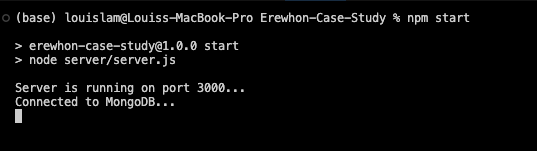
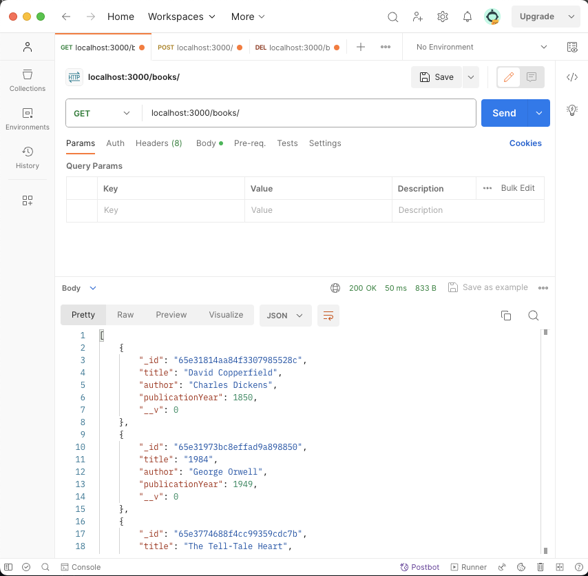
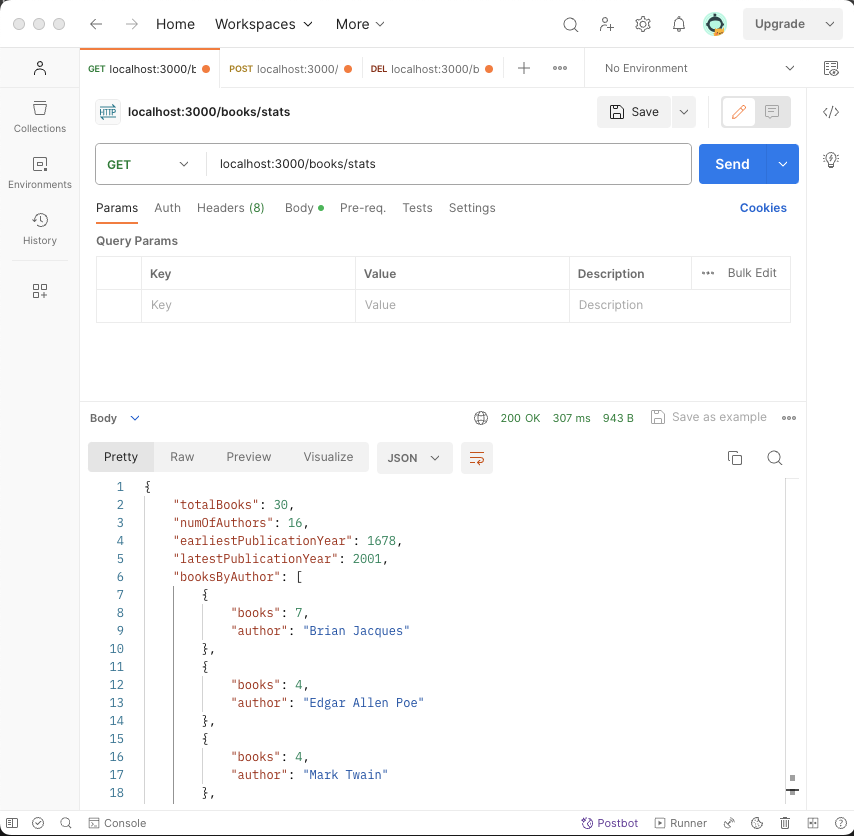

# Louis Lam Erewhon-Case-Study (Spring 2024)

## Setup instructions
1. Install all dependencies by typing ```npm install``` in the terminal.
2. Download an app like <a href='https://www.postman.com/'> Postman </a> to simulate API requests.
3. After installing the dependencies, type ```npm start``` to start the server locally and connect to my MongoDB database.
<br/>

<em>If the server is not starting even with alternative ports, make sure to type `killall node` in your terminal to stop other instances from interefering.</em>


4. When the server is running and connected to the DB, it will look like this:

      

## Testing Routes

1. Start by typing in the address of the server ```localhost:3000/books``` and replace 3000 with other port numbers if needed
2. Once you send a ```GET``` request, it will fetch the data from the server and populate below in JSON format. (See example)


    

<br/>

*  ***Here's another example with ```localhost:3000/books/stats```***

<br/>

  


##
### Please let me know if there are any questions, thank you! - Louis